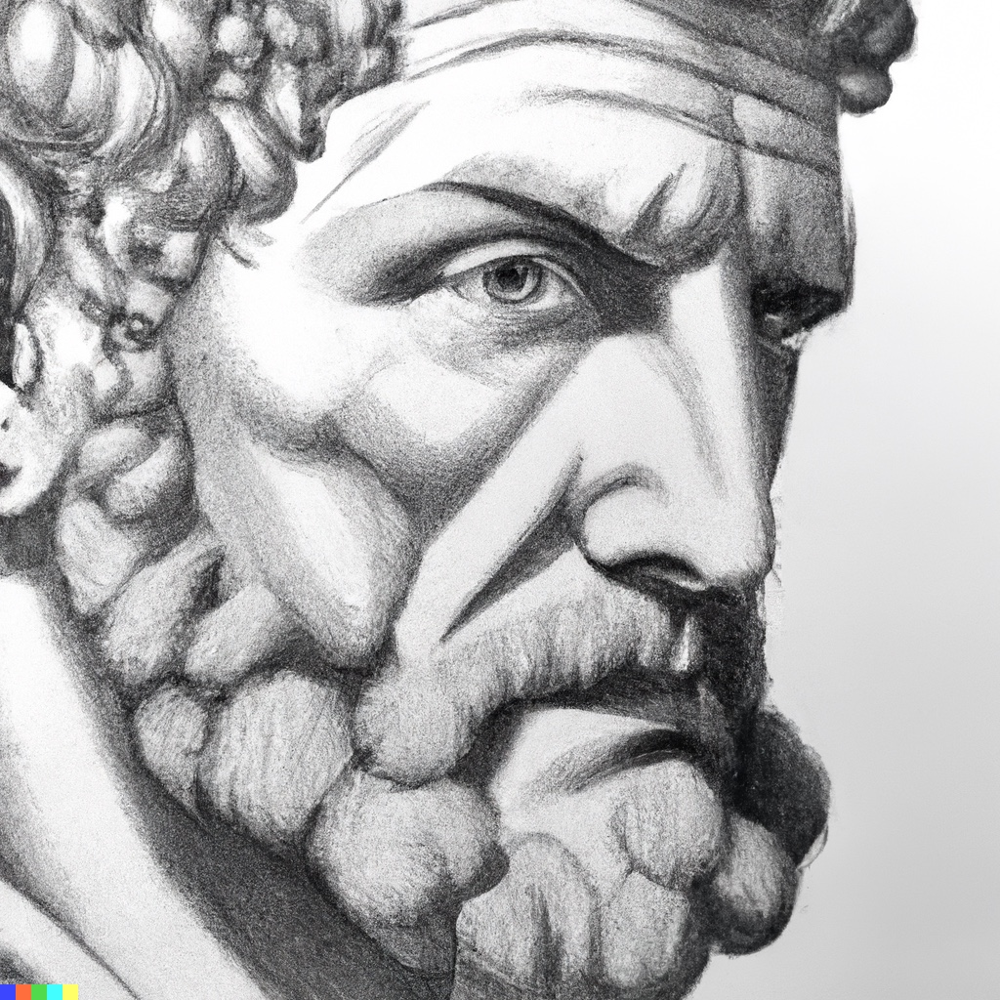

# [Meditations GPT](meditations-gpt)

A quick experiment with the OpenAI API to create a basic chat interface around Marcus Aurelius Meditations.



_Image generated by DALL·E 2_

### Try it out

🚀 [meditations-gpt](https://meditations-gpt.herokuapp.com)

### References

These materials were the inspiration for this repo.

- [Meditations - wikisource.org](https://en.wikisource.org/wiki/Marcus_Aurelius_Antoninus_-_His_Meditations_concerning_himselfe)
- [OpenAI Cookbook](https://github.com/openai/openai-cookbook)
- [AI Search Engine Using FastAPI, Qdrant, and GPT-3](https://github.com/dylanjcastillo/ai-search-fastapi-qdrant-chatgpt)

## Development

This is a [Next.js](https://nextjs.org/) project bootstrapped with [`create-next-app`](https://github.com/vercel/next.js/tree/canary/packages/create-next-app).

First, run the development server:

```bash
yarn dev
```
